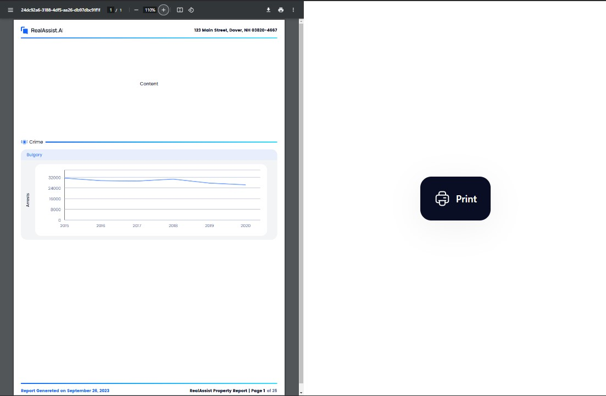

<a name="readme-top"></a>

<!-- PROJECT LOGO -->
<br />
<div align="center">
  <h1 align="center">Chart in PDF</h1>
  <p align="center">
    A React and TypeScript application that allows users to download PDF with a chart component.
    <br />
    <a href="https://driars.github.io/chart-pdf"><strong>Go to the home page »</strong></a>
    <br />
  </p>
</div>

<!-- TABLE OF CONTENTS -->
<details>
  <summary>Table of Contents</summary>
  <ol>
    <li>
      <a href="#about-the-project">About The Project</a>
      <ul>
        <li><a href="#built-with">Built With</a></li>
      </ul>
    </li>
    <li>
      <a href="#getting-started">Getting Started</a>
      <ul>
        <li><a href="#installation">Installation</a></li>
      </ul>
    </li>
    <li><a href="#usage">Usage</a></li>
    <li><a href="#roadmap">Roadmap</a></li>
    <li><a href="#contact">Contact</a></li>
  </ol>
</details>

<!-- ABOUT THE PROJECT -->

## About The Project

<p align="center">
  
</p>

<p align="right">(<a href="#readme-top">back to top</a>)</p>

### Built With

- ![React][React.js]
- ![TypeScript][TypeScript]
- ![GitHubActions][GitHubActions]
- ![GitHubPages][GitHubPages]

<p align="right">(<a href="#readme-top">back to top</a>)</p>

<!-- GETTING STARTED -->

## Getting Started

Deployed website:
[https://driars.github.io/chart-pdf](https://driars.github.io/chart-pdf)

### Installation

1. Clone the repo
   ```sh
   git clone https://github.com/driars/chart-pdf.git
   ```
2. Install NPM packages
   ```sh
   yarn
   ```
3. Enter your API in `.env`
   ```sh
   REACT_APP_API_KEY=YOUR_API_KEY
   ```
4. Build the website
   ```sh
   yarn build
   ```
5. Deploy the website
   ```sh
   yarn deploy
   ```

<p align="right">(<a href="#readme-top">back to top</a>)</p>

<!-- USAGE EXAMPLES -->

## Usage

A full stack application that will be generating a PDF by pressing a print button to show the below Graph visual using the API endpoint.
<br/>
Utilized `Github actions` and `Github pages` to implement `CI/CD` pipeline.
So when developers push codes or make a pull request to `master` branch, `Github actions` run automatically to test the code and deploy the build results to `Github pages`.

<p align="right">(<a href="#readme-top">back to top</a>)</p>

<!-- ROADMAP -->

## Roadmap

- [x] Display PDF Viewer
- [x] Download PDF when users press print button
- [x] Integrate API to fetch data from the end point
- [x] Build CI pipeline by github actions and github pages
- [x] Deploy the website to [https://driars.github.io/chart-pdf](https://driars.github.io/chart-pdf)

<p align="right">(<a href="#readme-top">back to top</a>)</p>

<!-- CONTACT -->

## Contact

driars - toptalent0107@gmail.com

Project Link: [https://github.com/driars/chart-pdf](https://github.com/driars/chart-pdf)

<p align="right">(<a href="#readme-top">back to top</a>)</p>

<!-- MARKDOWN LINKS & IMAGES -->
<!-- https://www.markdownguide.org/basic-syntax/#reference-style-links -->

[React.js]: https://img.shields.io/badge/React-20232A?style=for-the-badge&logo=react&logoColor=61DAFB
[Redux.js]: https://img.shields.io/badge/Redux-593D88?style=for-the-badge&logo=redux&logoColor=white
[TypeScript]: https://img.shields.io/badge/TypeScript-007ACC?style=for-the-badge&logo=typescript&logoColor=white
[Tailwind]: https://img.shields.io/badge/Tailwind_CSS-38B2AC?style=for-the-badge&logo=tailwind-css&logoColor=white
[Jest]: https://img.shields.io/badge/Jest-323330?style=for-the-badge&logo=Jest&logoColor=white
[Cypress]: https://img.shields.io/badge/Cypress-17202C?style=for-the-badge&logo=cypress&logoColor=white
[GitHubActions]: https://img.shields.io/badge/GitHub_Actions-2088FF?style=for-the-badge&logo=github-actions&logoColor=white
[GitHubPages]: https://img.shields.io/badge/GitHub%20Pages-222222?style=for-the-badge&logo=GitHub%20Pages&logoColor=white
